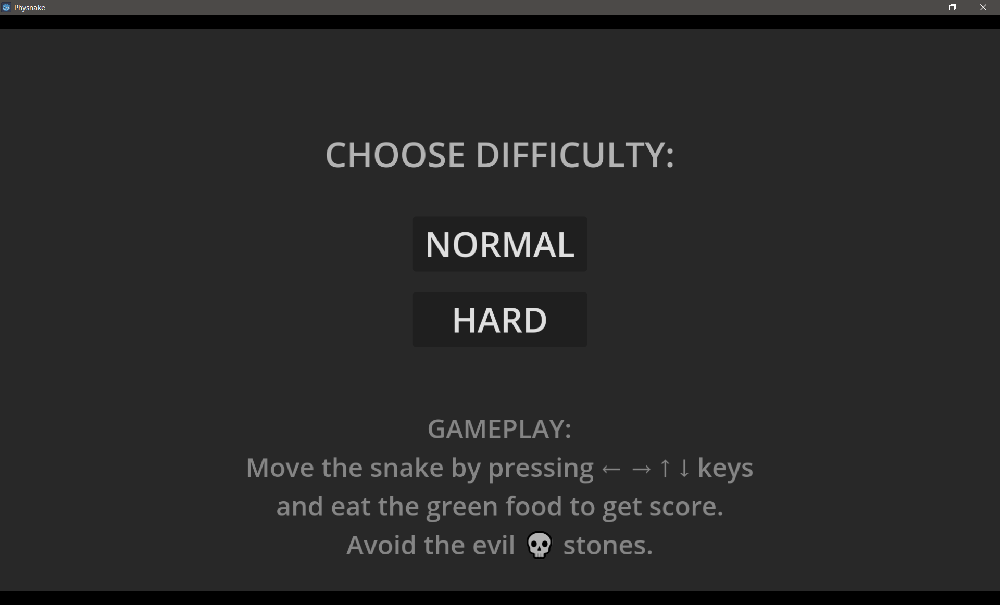
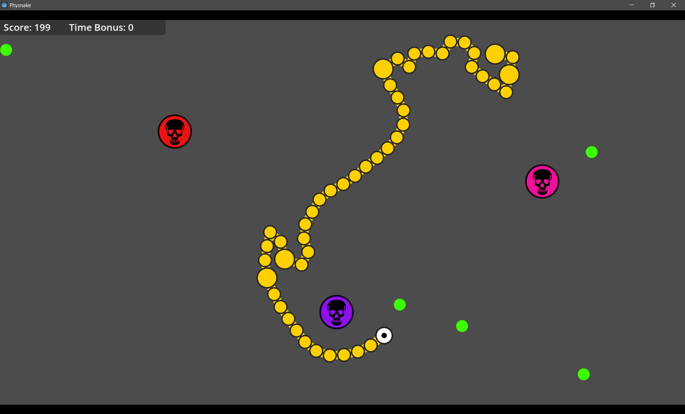
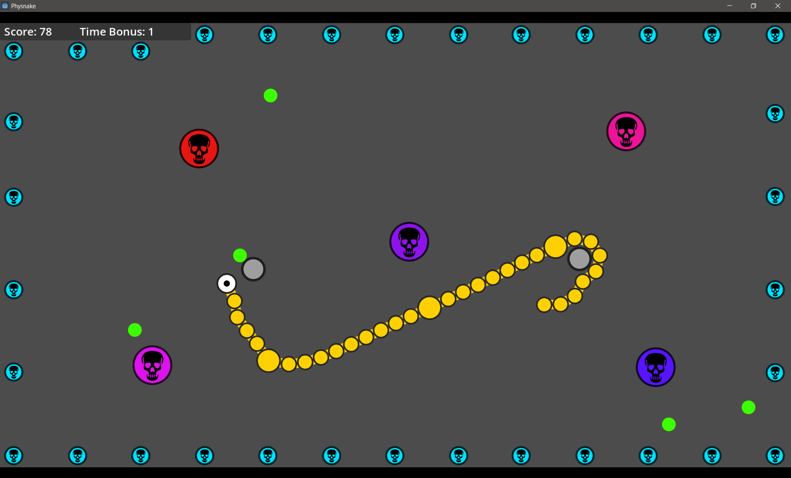
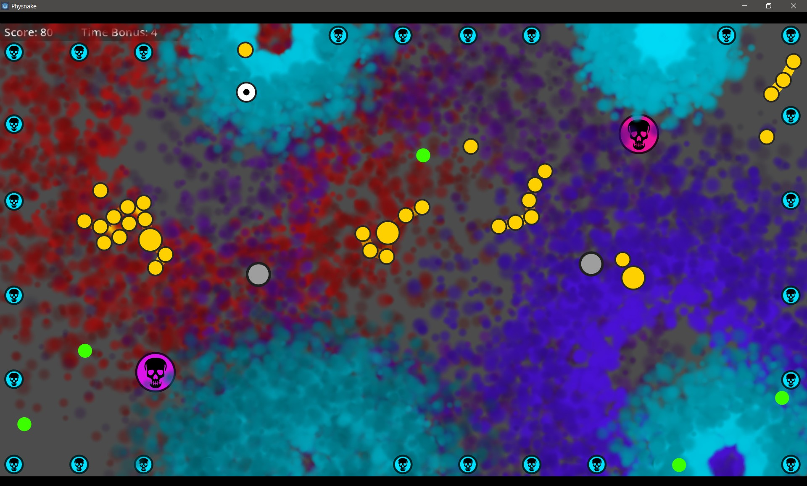
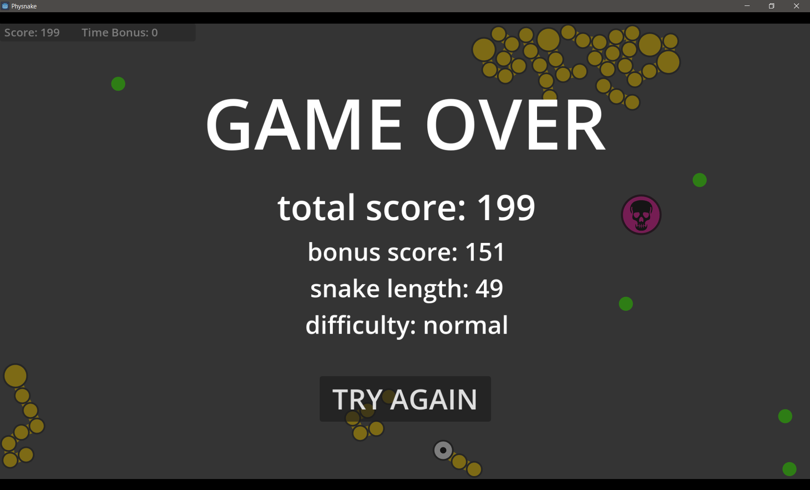

# Physnake
**A physics-based snake game (Godot 4 demo)**

I always wanted to know how a physics-based snake game could look and feel. For a two-day project the gameplay turned out to be kinda fun.

As a beginner using Godot, I wanted to try out a few techniques:
- Vector-like 2D graphics using only meshes, for perfect scalability and sharp edges. For creating the meshes, I started with SVG graphics, which were imported in Blender and exported as *.obj (wavefront), which Godot is able to import. Actually Godot can import SVG, but unfortunately it just converts SVG to textures, with less then optimal scaling quality (you may import with mipmap option and downscale, but it's still kinda blurry compared to mesh contures).
- Creating nodes and joints dynamically using script. The `DampedSpringJoint2D` that is used to connect the snake segments turned out to be less intuitive, as it requires us to define a starting point, an angle and a length, instead of simply two points to connect to.
- Custom collision detection to find a free spot for spawning food. This works well using `ShapeCast2D`.
- Explosions using GPU particles. This turned out really easy, after finding the right particle settings.
- Marking gdscripts as `@tool` to render game objects in the editor in the same way as in-game. This is required when a gdscript defines exported properties that change the look of the game object (e. g. when changing the "obstacle_size" property of an obstacle instance, the Godot editor immediately updates and draws the obstacle in the correct size).

